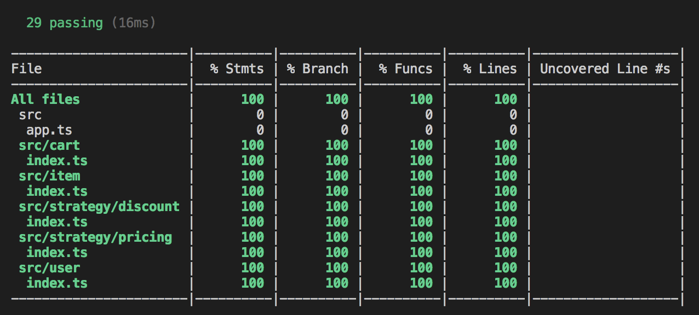
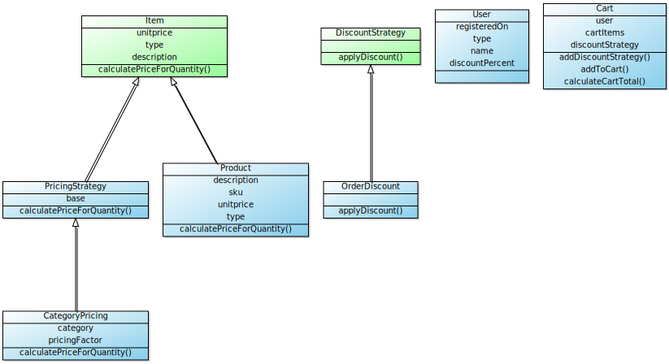

## Getting Started

### 
Prerequisite

<pre>
<code>$ node -v
v10.x.x</code>
</pre>

### 
Download the package and Run command to install packages:

<pre>
<code>$ npm install</code>
</pre>

### 
To run test:

<pre><code>$ npm run test</code>
</pre>

### 
To generate Code Coverage:

<pre><code>$ npm run test-coverage</code>
</pre>

## UML Diagram

